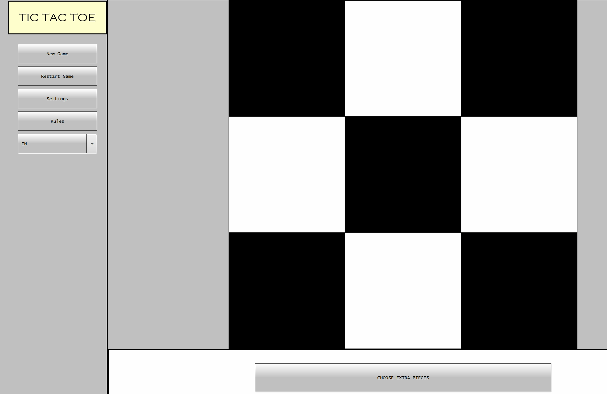

# Description
Our team has built a board game engine which allows users to create and fully create strategy board games from scratch. Users can configure everything, from the number of pieces to the allowed movement logic in a single JSON file. Play against our custom AI which utilizes a minmax algorithm, or switch to two player. The user has unlimited flexibility! Built by Eric Jiang, Alexander Uzochukwu, Turner Jordan, and Muthukurisil Arivoli.

